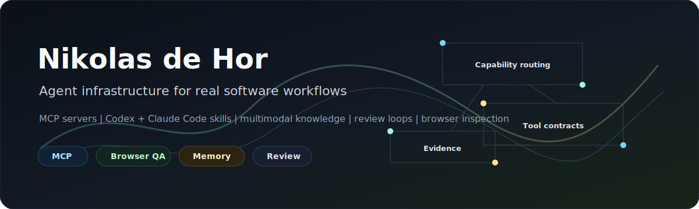

# Nikolas de Hor

AI engineer building production-grade agent infrastructure.

COO and co-founder at [FOR6 Solutions](https://github.com/For6Solutions), based in Goiania, Brazil. I work on the layer where agents need real tools: MCP servers, browser inspection, multimodal knowledge, code intelligence, review gates, and domain workflows.

[dehor.dev](https://dehor.dev) | [DeHor Labs](https://github.com/DeHor-Labs) | [LinkedIn](https://br.linkedin.com/in/nikolasdehor) | [Email](mailto:nikolasdehor79@gmail.com)

## Start Here

### Agent Operating Layer

- **[Agent Capability Router](https://github.com/DeHor-Labs/agent-capability-router)** - a runtime-neutral skill that helps Codex and Claude Code choose the right capability before they underuse or overuse tools.
- **[Visual Eyes](https://github.com/DeHor-Labs/visual-eyes)** - visual inspection for running web apps in Claude Code.
- **[Semtree](https://github.com/DeHor-Labs/semtree)** - semantic code-tree tooling for AI assistants working with large codebases.
- **[ShieldCode](https://github.com/DeHor-Labs/shieldcode)** - security hardening and production-grade error handling for AI-assisted development workflows.

### Knowledge And Domain Systems

- **[TranscreveAI](https://github.com/DeHor-Labs/transcreve-ai)** - video links into searchable multimodal dossiers, content packs, skill drafts, and RAG-ready knowledge.
- **[MCP Fiscal Brasil](https://github.com/DeHor-Labs/mcp-fiscal-brasil)** - Brazilian fiscal workflows through MCP: CNPJ, NFe, NFSe, SPED, eSocial, and related automations.

## Operating Principles

- Agents should inspect, verify, and remember.
- Context should be searchable, versioned, and reusable.
- CI, security review, and traceable decisions belong in the workflow.
- Domain automation has to survive credentials, latency, browser state, and production constraints.

## Current Focus

Agent-ready video and document intelligence | MCP servers | Codex and Claude Code skills | AI code review and security | browser/UI inspection | Brazilian fiscal automation

## Stack

`Python` `TypeScript` `Go` `React` `FastAPI` `Docker` `SQLite/Postgres` `MCP` `RAG` `Flutter`
